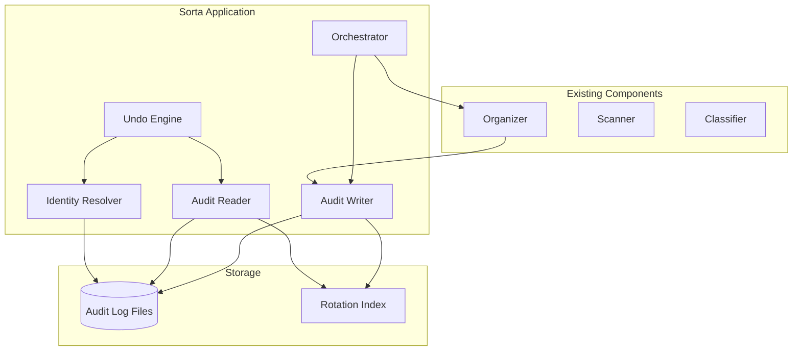

# Design Document: Audit Trail

## Overview

The Audit Trail system provides complete traceability, reversibility, and cross-machine portability for all Sorta file operations. It implements an append-only event log that serves as the source of truth for what occurred during each program execution, enabling deterministic undo of any run.

### Goals
- **Traceability**: Every file operation is logged with sufficient detail for human review
- **Reversibility**: Any run can be undone, including across machines
- **Deterministic replay**: Undo operations produce predictable, repeatable results
- **Cross-machine portability**: Audit logs work across different machines with path mapping
- **Safety guarantees**: No file operation occurs without a durable audit record

### Non-Goals
- Remote aggregation or cloud sync
- Analytics or telemetry
- Real-time monitoring dashboards
- External logging services integration

## Architecture



### Component Responsibilities

1. **Audit Writer**: Handles all write operations to the audit log, including rotation and fail-fast behavior
2. **Audit Reader**: Reads and parses audit events, handles multi-segment logs
3. **Undo Engine**: Orchestrates undo operations, processes events in reverse order
4. **Identity Resolver**: Matches files across machines using content hash and secondary attributes

## Components and Interfaces

### AuditWriter Interface

```go
type AuditWriter interface {
    // StartRun initializes a new run and returns the Run ID
    StartRun(appVersion string, machineID string) (RunID, error)
    
    // WriteEvent writes a single event, failing fast if write fails
    WriteEvent(event AuditEvent) error
    
    // EndRun records run completion status
    EndRun(runID RunID, status RunStatus, summary RunSummary) error
    
    // Close flushes and closes the writer
    Close() error
}
```

### AuditReader Interface

```go
type AuditReader interface {
    // ListRuns returns all runs with summary information
    ListRuns() ([]RunInfo, error)
    
    // GetRun returns all events for a specific run
    GetRun(runID RunID) ([]AuditEvent, error)
    
    // GetLatestRun returns the most recent run
    GetLatestRun() (*RunInfo, error)
    
    // FilterEvents returns events matching criteria
    FilterEvents(runID RunID, filter EventFilter) ([]AuditEvent, error)
}
```

### UndoEngine Interface

```go
type UndoEngine interface {
    // UndoLatest undoes the most recent run
    UndoLatest(pathMappings []PathMapping) (*UndoResult, error)
    
    // UndoRun undoes a specific run by ID
    UndoRun(runID RunID, pathMappings []PathMapping) (*UndoResult, error)
    
    // PreviewUndo shows what would be undone without executing
    PreviewUndo(runID RunID, pathMappings []PathMapping) (*UndoPreview, error)
}
```

### IdentityResolver Interface

```go
type IdentityResolver interface {
    // CaptureIdentity captures file identity before an operation
    CaptureIdentity(path string) (*FileIdentity, error)
    
    // VerifyIdentity checks if a file matches expected identity
    VerifyIdentity(path string, expected FileIdentity) (IdentityMatch, error)
    
    // FindByHash searches for a file by content hash in given directories
    FindByHash(hash string, searchDirs []string) ([]string, error)
}
```

## Data Models

### RunID

```go
type RunID string  // UUID v4 format: "xxxxxxxx-xxxx-4xxx-yxxx-xxxxxxxxxxxx"
```

### AuditEvent

```go
type AuditEvent struct {
    Timestamp       time.Time         `json:"timestamp"`        // ISO 8601 format
    RunID           RunID             `json:"runId"`
    EventType       EventType         `json:"eventType"`
    Status          OperationStatus   `json:"status"`
    SourcePath      string            `json:"sourcePath,omitempty"`
    DestinationPath string            `json:"destinationPath,omitempty"`
    ReasonCode      ReasonCode        `json:"reasonCode,omitempty"`
    FileIdentity    *FileIdentity     `json:"fileIdentity,omitempty"`
    ErrorDetails    *ErrorDetails     `json:"errorDetails,omitempty"`
    Metadata        map[string]string `json:"metadata,omitempty"`
}
```

### EventType Enumeration

```go
type EventType string

const (
    // Run lifecycle events
    EventRunStart       EventType = "RUN_START"
    EventRunEnd         EventType = "RUN_END"
    
    // File operation events
    EventMove           EventType = "MOVE"
    EventRouteToReview  EventType = "ROUTE_TO_REVIEW"
    EventSkip           EventType = "SKIP"
    EventDuplicateDetected EventType = "DUPLICATE_DETECTED"
    EventParseFailure   EventType = "PARSE_FAILURE"
    EventValidationFailure EventType = "VALIDATION_FAILURE"
    EventError          EventType = "ERROR"
    
    // Undo events
    EventUndoMove       EventType = "UNDO_MOVE"
    EventUndoSkip       EventType = "UNDO_SKIP"
    EventIdentityMismatch EventType = "IDENTITY_MISMATCH"
    EventAmbiguousIdentity EventType = "AMBIGUOUS_IDENTITY"
    EventCollision      EventType = "COLLISION"
    EventSourceMissing  EventType = "SOURCE_MISSING"
    EventContentChanged EventType = "CONTENT_CHANGED"
    EventConflictDetected EventType = "CONFLICT_DETECTED"
    
    // System events
    EventRotation       EventType = "ROTATION"
    EventRetentionPrune EventType = "RETENTION_PRUNE"
    EventLogInitialized EventType = "LOG_INITIALIZED"
)
```

### OperationStatus

```go
type OperationStatus string

const (
    StatusSuccess OperationStatus = "SUCCESS"
    StatusFailure OperationStatus = "FAILURE"
    StatusSkipped OperationStatus = "SKIPPED"
)
```

### ReasonCode Enumeration

```go
type ReasonCode string

const (
    // Skip reasons
    ReasonNoMatch         ReasonCode = "NO_MATCH"
    ReasonInvalidDate     ReasonCode = "INVALID_DATE"
    ReasonAlreadyProcessed ReasonCode = "ALREADY_PROCESSED"
    
    // Review routing reasons
    ReasonUnclassified    ReasonCode = "UNCLASSIFIED"
    ReasonParseError      ReasonCode = "PARSE_ERROR"
    ReasonValidationError ReasonCode = "VALIDATION_ERROR"
    
    // Duplicate reasons
    ReasonDuplicateRenamed ReasonCode = "DUPLICATE_RENAMED"
    
    // Undo skip reasons
    ReasonNoOpEvent       ReasonCode = "NO_OP_EVENT"
    ReasonIdentityMismatch ReasonCode = "IDENTITY_MISMATCH"
    ReasonDestinationOccupied ReasonCode = "DESTINATION_OCCUPIED"
    ReasonSourceNotFound  ReasonCode = "SOURCE_NOT_FOUND"
    ReasonConflictWithLaterRun ReasonCode = "CONFLICT_WITH_LATER_RUN"
)
```

### FileIdentity

```go
type FileIdentity struct {
    ContentHash string    `json:"contentHash"`  // SHA-256 hex string
    Size        int64     `json:"size"`         // Bytes
    ModTime     time.Time `json:"modTime"`      // File modification time
}
```

### ErrorDetails

```go
type ErrorDetails struct {
    ErrorType    string `json:"errorType"`
    ErrorMessage string `json:"errorMessage"`
    Operation    string `json:"operation"`
}
```

### RunInfo

```go
type RunInfo struct {
    RunID        RunID           `json:"runId"`
    StartTime    time.Time       `json:"startTime"`
    EndTime      *time.Time      `json:"endTime,omitempty"`
    Status       RunStatus       `json:"status"`
    RunType      RunType         `json:"runType"`
    AppVersion   string          `json:"appVersion"`
    MachineID    string          `json:"machineId"`
    Summary      RunSummary      `json:"summary"`
    UndoTargetID *RunID          `json:"undoTargetId,omitempty"`  // For UNDO runs
}

type RunStatus string

const (
    RunStatusInProgress RunStatus = "IN_PROGRESS"
    RunStatusCompleted  RunStatus = "COMPLETED"
    RunStatusFailed     RunStatus = "FAILED"
    RunStatusInterrupted RunStatus = "INTERRUPTED"
)

type RunType string

const (
    RunTypeOrganize RunType = "ORGANIZE"
    RunTypeUndo     RunType = "UNDO"
)

type RunSummary struct {
    TotalFiles    int `json:"totalFiles"`
    Moved         int `json:"moved"`
    Skipped       int `json:"skipped"`
    RoutedReview  int `json:"routedReview"`
    Duplicates    int `json:"duplicates"`
    Errors        int `json:"errors"`
}
```

### PathMapping (for cross-machine undo)

```go
type PathMapping struct {
    OriginalPrefix string `json:"originalPrefix"`  // e.g., "/Users/alice/Documents"
    MappedPrefix   string `json:"mappedPrefix"`    // e.g., "/home/bob/Documents"
}
```

### AuditConfig

```go
type AuditConfig struct {
    LogDirectory     string        `json:"logDirectory"`
    RotationSize     int64         `json:"rotationSizeBytes"`    // Rotate when file exceeds this size
    RotationPeriod   string        `json:"rotationPeriod"`       // "daily", "weekly", or ""
    RetentionDays    int           `json:"retentionDays"`        // 0 = unlimited
    RetentionRuns    int           `json:"retentionRuns"`        // 0 = unlimited
    MinRetentionDays int           `json:"minRetentionDays"`     // Default: 7
}
```

### Log File Format

The audit log uses JSON Lines format (one JSON object per line):

```
{"timestamp":"2024-03-15T10:30:00Z","runId":"abc-123","eventType":"RUN_START",...}
{"timestamp":"2024-03-15T10:30:01Z","runId":"abc-123","eventType":"MOVE",...}
{"timestamp":"2024-03-15T10:30:02Z","runId":"abc-123","eventType":"MOVE",...}
```

Log file naming convention:
- Active log: `sorta-audit.jsonl`
- Rotated segments: `sorta-audit-YYYYMMDD-HHMMSS.jsonl`
- Index file: `sorta-audit-index.json`


## Correctness Properties

*A property is a characteristic or behavior that should hold true across all valid executions of a system—essentially, a formal statement about what the system should do. Properties serve as the bridge between human-readable specifications and machine-verifiable correctness guarantees.*

### Property 1: Run_ID Uniqueness and Format

*For any* collection of generated Run_IDs, each Run_ID SHALL be unique and SHALL match the UUID v4 format pattern.

**Validates: Requirements 1.1, 1.2**

### Property 2: Run Lifecycle Event Ordering

*For any* completed run, the first event SHALL be of type RUN_START and the last event SHALL be of type RUN_END, with all other events occurring between them.

**Validates: Requirements 1.4, 1.5**

### Property 3: Event Field Completeness by Type

*For any* audit event:
- All events SHALL have timestamp (ISO 8601), runId, eventType, and status fields
- MOVE events SHALL have sourcePath, destinationPath, and fileIdentity
- ROUTE_TO_REVIEW events SHALL have sourcePath, destinationPath, and reasonCode
- SKIP events SHALL have sourcePath and reasonCode
- DUPLICATE_DETECTED events SHALL have sourcePath, intended destination, actual destination
- ERROR events SHALL have sourcePath, errorType, and errorMessage

**Validates: Requirements 2.1, 2.2, 2.3, 2.4, 2.5, 2.6, 2.7, 3.1, 3.2, 3.3, 3.4, 3.5, 3.6, 3.7**

### Property 4: One Event Per File

*For any* file processed in a run, there SHALL be exactly one primary event (MOVE, ROUTE_TO_REVIEW, SKIP, or ERROR) recorded for that file.

**Validates: Requirements 2.8**

### Property 5: FileIdentity Completeness for Move Operations

*For any* MOVE event, the fileIdentity field SHALL contain a valid SHA-256 contentHash, non-negative size in bytes, and modTime timestamp.

**Validates: Requirements 4.1, 4.2, 4.3, 4.4**

### Property 6: Content Hash as Primary Identity for Undo

*For any* undo operation, if the content hash of the file at the destination matches the recorded hash, the undo SHALL proceed regardless of path differences. If the hash does not match, the undo SHALL abort for that file and record an IDENTITY_MISMATCH event.

**Validates: Requirements 4.6, 4.7, 4.8, 7.4**

### Property 7: Undo Reverse Chronological Ordering

*For any* undo operation on a run, events SHALL be processed in reverse chronological order of their original timestamps.

**Validates: Requirements 5.2**

### Property 8: Undo Restores File Locations

*For any* MOVE or ROUTE_TO_REVIEW event that is undone, the file SHALL be moved from its destination back to its original source location, provided identity verification passes.

**Validates: Requirements 5.3, 5.4**

### Property 9: Undo Idempotency

*For any* run, executing undo twice SHALL produce the same filesystem end state as executing undo once.

**Validates: Requirements 13.6**

### Property 10: Append-Only Log Integrity

*For any* sequence of write operations to the audit log, existing records SHALL remain unchanged and the log file size SHALL never decrease during normal operation.

**Validates: Requirements 8.1, 8.5**

### Property 11: JSON Lines Round-Trip

*For any* valid AuditEvent, serializing to JSON Lines format and deserializing SHALL produce an equivalent event object.

**Validates: Requirements 8.2, 8.3**

### Property 12: Rotation Segment Discoverability

*For any* rotated log, all segments SHALL be discoverable via the index file or naming convention, and reading all segments SHALL return all events in chronological order.

**Validates: Requirements 9.3, 9.4, 9.5**

### Property 13: Fail-Fast on Audit Write Failure

*For any* audit write failure, no subsequent file operations SHALL occur in that run.

**Validates: Requirements 11.1, 11.3, 11.5**

### Property 14: Audit-Before-Move Ordering

*For any* file move operation, the corresponding audit record SHALL be durably written before the file is moved.

**Validates: Requirements 11.4**

### Property 15: Undo Collision Safety

*For any* undo operation where the destination already contains a file, the existing file SHALL NOT be overwritten and a COLLISION event SHALL be recorded.

**Validates: Requirements 13.1, 13.2**

### Property 16: Event Filtering Correctness

*For any* event filter applied to a run, the returned events SHALL contain only events matching the filter criteria and SHALL contain all events matching the filter criteria.

**Validates: Requirements 15.5**

### Property 17: Minimum Retention Protection

*For any* retention pruning operation, log segments containing runs less than the configured minimum age SHALL NOT be pruned.

**Validates: Requirements 10.4**

## Error Handling

### Audit Write Failures

When an audit record cannot be written:
1. The AuditWriter SHALL return an error immediately
2. The Orchestrator SHALL halt all file processing
3. The error SHALL include specific details (disk full, permission denied, etc.)
4. No partial state SHALL be left (either the event is written or it isn't)

### Log Corruption Detection

On startup, the AuditReader SHALL:
1. Validate that the last line of the active log is complete JSON
2. If incomplete, mark the log as potentially corrupt
3. Offer recovery options: archive and start fresh, or attempt repair

### Undo Failure Modes

| Failure | Behavior | Event Recorded |
|---------|----------|----------------|
| File missing at destination | Skip, continue | SOURCE_MISSING |
| Content hash mismatch | Skip, continue | IDENTITY_MISMATCH |
| Multiple hash matches | Skip, continue | AMBIGUOUS_IDENTITY |
| Destination occupied | Skip, continue | COLLISION |
| Permission denied | Skip, continue | ERROR |
| Disk full | Halt undo | ERROR |

### Error Recording Policy

- Error messages SHALL be descriptive but SHALL NOT contain:
  - Environment variable values
  - Credentials or tokens
  - Full stack traces (unless configured)
- Sensitive path components MAY be redacted if configured

## Testing Strategy

### Dual Testing Approach

The audit trail system requires both unit tests and property-based tests:

- **Unit tests**: Verify specific examples, edge cases, and error conditions
- **Property tests**: Verify universal properties across all inputs using randomized testing

### Property-Based Testing Configuration

- Library: `gopter` (Go property testing library, already used in Sorta)
- Minimum iterations: 100 per property test
- Each test tagged with: `Feature: audit-trail, Property N: <property_text>`

### Test Categories

#### Unit Tests
- Event serialization/deserialization for each event type
- Run lifecycle (start, events, end)
- Specific error conditions (disk full, permission denied)
- Path mapping translation
- Log rotation at exact size boundary

#### Property Tests
- Run_ID uniqueness across generated IDs
- Event field completeness by type
- JSON Lines round-trip for all event types
- Append-only integrity verification
- Undo idempotency
- Event filtering correctness

### Golden Test Scenarios

1. **Normal run with mixed outcomes**: Move 3 files, skip 2, route 1 to review, 1 duplicate
2. **Rotation mid-run**: Run that triggers rotation, verify events span segments correctly
3. **Fail-fast on write failure**: Simulate disk full, verify no file moves after failure
4. **Undo most recent run**: Execute run, undo, verify files restored
5. **Undo earlier run**: Execute 3 runs, undo run 2, verify correct files affected
6. **Cross-machine undo**: Create audit on "machine A", apply undo with path mappings
7. **Ambiguity detection**: Two files with same hash, verify AMBIGUOUS_IDENTITY event
8. **Collision during undo**: File exists at undo destination, verify COLLISION event
9. **Corrupt log detection**: Truncate last line, verify corruption detected on startup
10. **Retention pruning**: Configure 2-run retention, execute 4 runs, verify oldest 2 pruned

### Test File Organization

```
internal/audit/
├── writer.go
├── writer_test.go
├── reader.go
├── reader_test.go
├── undo.go
├── undo_test.go
├── identity.go
├── identity_test.go
├── rotation.go
├── rotation_test.go
└── properties_test.go  # All property-based tests
```
