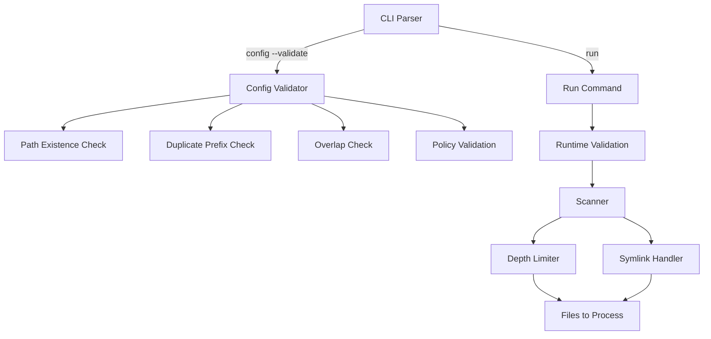

# Design Document: Config Validation

## Overview

This design adds configuration validation capabilities to Sorta:
1. A `--validate` flag for the config command to check for errors
2. Symlink handling policy configuration
3. Scan depth limiting for inbound directory processing
4. Runtime path validation before processing

## Architecture

The changes add a validation module and extend the scanner with depth and symlink awareness.



## Components and Interfaces

### Config Validator (`internal/config/validator.go`)

New validation component:

```go
// ValidationError represents a single validation issue
type ValidationError struct {
    Field   string  // Config field with issue
    Message string  // Human-readable description
    Severity string // "error" or "warning"
}

// ValidationResult contains all validation findings
type ValidationResult struct {
    Errors   []ValidationError
    Warnings []ValidationError
    Valid    bool
}

// Validate checks the configuration for errors
func Validate(cfg *Configuration) *ValidationResult

// ValidatePaths checks that all configured paths exist or are creatable
func ValidatePaths(cfg *Configuration) []ValidationError

// ValidatePrefixRules checks for duplicates and overlaps
func ValidatePrefixRules(cfg *Configuration) []ValidationError

// ValidatePolicies checks symlink and other policy values
func ValidatePolicies(cfg *Configuration) []ValidationError
```

### Configuration Updates (`internal/config/config.go`)

Extend configuration with new fields:

```go
type Configuration struct {
    InboundDirectories []string      `json:"inboundDirectories"`
    PrefixRules        []PrefixRule  `json:"prefixRules"`
    Audit              *AuditConfig  `json:"audit,omitempty"`
    SymlinkPolicy      string        `json:"symlinkPolicy,omitempty"`  // "follow", "skip", "error"
    ScanDepth          *int          `json:"scanDepth,omitempty"`      // nil = default (0)
}

// GetSymlinkPolicy returns the configured policy or default "skip"
func (c *Configuration) GetSymlinkPolicy() string

// GetScanDepth returns the configured depth or default 0
func (c *Configuration) GetScanDepth() int
```

### Scanner Updates (`internal/scanner/scanner.go`)

Extend scanner with depth and symlink handling:

```go
// ScanOptions configures scanning behavior
type ScanOptions struct {
    MaxDepth      int     // Maximum depth to scan (0 = immediate only)
    SymlinkPolicy string  // "follow", "skip", or "error"
}

// ScanWithOptions scans directory with configurable options
func ScanWithOptions(dir string, opts ScanOptions) ([]FileInfo, error)
```

### CLI Updates (`cmd/sorta/main.go`)

Add new flags:

```go
// sorta config --validate
// sorta run --depth N
```

## Data Models

### ValidationError

```go
type ValidationError struct {
    Field    string  // e.g., "inboundDirectories[0]", "prefixRules[1].prefix"
    Message  string  // e.g., "Directory does not exist"
    Severity string  // "error" or "warning"
}
```

### ValidationResult

```go
type ValidationResult struct {
    Errors   []ValidationError  // Issues that prevent operation
    Warnings []ValidationError  // Issues that may cause problems
    Valid    bool               // True if no errors (warnings OK)
}
```

### ScanOptions

```go
type ScanOptions struct {
    MaxDepth      int     // 0 = immediate, 1 = one level, -1 = unlimited
    SymlinkPolicy string  // "follow", "skip", "error"
}
```

## Correctness Properties

*A property is a characteristic or behavior that should hold true across all valid executions of a system—essentially, a formal statement about what the system should do. Properties serve as the bridge between human-readable specifications and machine-verifiable correctness guarantees.*

### Property 1: Validation Reports All Errors

*For any* configuration with multiple errors, the validation SHALL report all errors (not just the first), return a non-zero exit code, and include clear descriptions for each error.

**Validates: Requirements 1.1, 1.7, 1.8**

### Property 2: Path Existence Validation

*For any* configuration, validation SHALL verify that all inbound directories exist and are accessible, and that all outbound directories either exist or have writable parent directories.

**Validates: Requirements 1.2, 1.3**

### Property 3: Duplicate and Overlap Detection

*For any* configuration with duplicate prefixes (case-insensitive) or overlapping outbound directories, validation SHALL detect and report these issues.

**Validates: Requirements 1.4, 1.5**

### Property 4: Symlink Policy Validation

*For any* configuration, the symlinkPolicy field SHALL only accept values "follow", "skip", or "error". Invalid values SHALL cause validation failure.

**Validates: Requirements 2.1, 2.6**

### Property 5: Symlink Policy Behavior

*For any* directory containing symlinks, the scanner SHALL follow symlinks when policy is "follow", skip them when policy is "skip", and report errors when policy is "error".

**Validates: Requirements 2.2, 2.3, 2.4**

### Property 6: Scan Depth Limiting

*For any* inbound directory with nested subdirectories and any scan depth N >= 0, the scanner SHALL only process files at depth <= N. The --depth CLI flag SHALL override the configured scanDepth.

**Validates: Requirements 3.1, 3.2, 3.5, 3.6, 3.7**

### Property 7: Runtime Path Validation

*For any* run operation, Sorta SHALL validate that inbound directories exist before processing. Non-existent directories SHALL be skipped with an error message, and remaining directories SHALL still be processed.

**Validates: Requirements 4.1, 4.2**

## Error Handling

| Error Condition | Behavior |
|----------------|----------|
| Inbound directory doesn't exist | Validation error; runtime skip with warning |
| Outbound parent not writable | Validation error |
| Duplicate prefix | Validation error |
| Invalid symlink policy | Validation error |
| Negative scan depth | Validation error |
| Symlink with "error" policy | Runtime error for that file |

## Testing Strategy

### Property-Based Testing

Property-based tests will use the `gopter` library. Each test runs minimum 100 iterations.

**Properties to implement:**

1. **All errors reported**: Generate configs with multiple errors, verify all found
2. **Path validation**: Generate configs with various path states
3. **Duplicate detection**: Generate configs with duplicate prefixes
4. **Symlink policy validation**: Generate configs with various policy values
5. **Symlink behavior**: Create symlinks, test each policy
6. **Depth limiting**: Generate nested structures, verify depth respected
7. **Runtime validation**: Test with missing directories

### Unit Tests

- Valid configuration passes
- Missing inbound directory fails
- Duplicate prefix detected
- Overlapping outbound detected
- Invalid symlink policy rejected
- Symlink follow behavior
- Symlink skip behavior
- Symlink error behavior
- Depth 0 (immediate only)
- Depth override via CLI
