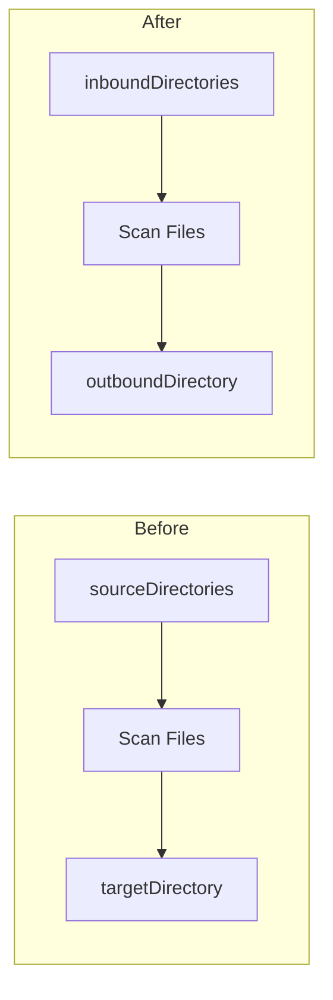

# Design Document: Rename Source/Target to Inbound/Outbound

## Overview

This design describes a terminology refactoring across the Sorta codebase, changing "source" to "inbound" and "target" to "outbound". This is a mechanical refactoring that affects configuration files, Go structs, CLI commands, and documentation.

The change improves semantic clarity:
- **Inbound**: Directories where files come from (to be organized)
- **Outbound**: Directories where files go to (organized destinations)

## Architecture

No architectural changes are required. This is a naming refactoring that preserves all existing behavior.



## Components and Interfaces

### Configuration Struct Changes

**Before:**
```go
type PrefixRule struct {
    Prefix          string `json:"prefix"`
    TargetDirectory string `json:"targetDirectory"`
}

type Configuration struct {
    SourceDirectories []string     `json:"sourceDirectories"`
    PrefixRules       []PrefixRule `json:"prefixRules"`
    Audit             *AuditConfig `json:"audit,omitempty"`
}
```

**After:**
```go
type PrefixRule struct {
    Prefix            string `json:"prefix"`
    OutboundDirectory string `json:"outboundDirectory"`
}

type Configuration struct {
    InboundDirectories []string     `json:"inboundDirectories"`
    PrefixRules        []PrefixRule `json:"prefixRules"`
    Audit              *AuditConfig `json:"audit,omitempty"`
}
```

### Method Renames

| Before | After |
|--------|-------|
| `HasSourceDirectory(dir string)` | `HasInboundDirectory(dir string)` |
| `AddSourceDirectory(dir string)` | `AddInboundDirectory(dir string)` |

### CLI Command Changes

| Before | After |
|--------|-------|
| `sorta add-source <dir>` | `sorta add-inbound <dir>` |

### Classifier Result Changes

**Before:**
```go
type ClassificationResult struct {
    Year               int
    NormalisedFilename string
    TargetDirectory    string
}
```

**After:**
```go
type ClassificationResult struct {
    Year               int
    NormalisedFilename string
    OutboundDirectory  string
}
```

## Data Models

### JSON Configuration Schema

**Before:**
```json
{
  "sourceDirectories": ["dir1", "dir2"],
  "prefixRules": [
    {"prefix": "Invoice", "targetDirectory": "vendor/Invoices"}
  ]
}
```

**After:**
```json
{
  "inboundDirectories": ["dir1", "dir2"],
  "prefixRules": [
    {"prefix": "Invoice", "outboundDirectory": "vendor/Invoices"}
  ]
}
```

## Files Requiring Changes

### Go Source Files
1. `internal/config/config.go` - Struct fields, JSON tags, method names, validation messages
2. `internal/config/config_test.go` - Test assertions and JSON literals
3. `internal/classifier/classifier.go` - ClassificationResult struct field
4. `internal/classifier/classifier_test.go` - Test assertions
5. `internal/matcher/matcher_test.go` - Test data
6. `internal/orchestrator/orchestrator.go` - Field references
7. `internal/orchestrator/orchestrator_test.go` - Test data
8. `cmd/sorta/main.go` - CLI command name, help text, display functions

### Configuration Files
1. `testdata/sorta-config.json` - JSON keys

### Documentation
1. `README.md` - Terminology updates

### Shell Scripts
1. `generate_testdata.sh` - Variable names (optional, uses "TARGET" for local variable)

## Correctness Properties

*A property is a characteristic or behavior that should hold true across all valid executions of a system—essentially, a formal statement about what the system should do. Properties serve as the bridge between human-readable specifications and machine-verifiable correctness guarantees.*

### Property 1: Configuration JSON Round-Trip

*For any* valid Configuration object with inbound directories and prefix rules containing outbound directories, serializing to JSON and deserializing back SHALL produce an equivalent Configuration object with the same inboundDirectories array and the same prefixRules with matching outboundDirectory values.

**Validates: Requirements 1.1, 1.2, 1.3, 1.4**

### Property 2: Inbound Directory Duplicate Prevention

*For any* Configuration and any directory path that already exists in inboundDirectories, calling AddInboundDirectory with that path SHALL NOT modify the inboundDirectories array length, and the method SHALL return false.

**Validates: Requirements 2.3, 3.2**

## Error Handling

No changes to error handling logic. Error messages will be updated to use new terminology:
- "sourceDirectories must contain at least one directory" → "inboundDirectories must contain at least one directory"
- "prefixRules[%d].targetDirectory cannot be empty" → "prefixRules[%d].outboundDirectory cannot be empty"

## Testing Strategy

### Unit Tests
- Update existing unit tests to use new field names
- Verify JSON serialization/deserialization with new keys
- Verify validation error messages use new terminology

### Property-Based Tests
- Existing property tests in `config_test.go` will be updated to use new field names
- Property tests already cover round-trip consistency and duplicate prevention

### Integration Tests
- Update test configuration files to use new JSON keys
- Verify CLI commands work with new names

### Test Configuration
- Use Go's `testing/quick` package (already in use)
- Minimum 100 iterations per property test
