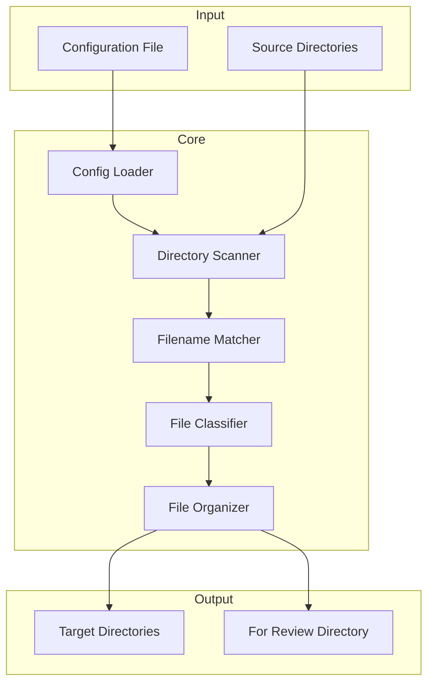

# Design Document: Sorta — Prefix-and-Date File Organizer

## Overview

Sorta is a command-line file organization utility that moves files from source directories into structured target directories based on filename prefixes and embedded ISO dates. The system reads configuration from a JSON file, scans source directories, classifies files according to prefix rules, and moves them to appropriate destinations while maintaining file integrity.

The design emphasizes:
- Deterministic, repeatable behavior
- Clear separation between configuration, classification, and file operations
- Robust error handling for edge cases
- Testable components with well-defined interfaces

## Architecture



### Data Flow

1. **Config Loader** reads and validates the JSON configuration
2. **Directory Scanner** enumerates files in each source directory
3. **Filename Matcher** evaluates each filename against prefix rules
4. **File Classifier** extracts dates and determines destination
5. **File Organizer** executes the file moves

## Components and Interfaces

### Configuration Types

```typescript
interface PrefixRule {
  prefix: string;           // Canonical casing of the prefix
  targetDirectory: string;  // Path to target directory
}

interface Configuration {
  sourceDirectories: string[];      // List of directories to scan
  prefixRules: PrefixRule[];        // Prefix-to-target mappings
  forReviewDirectory: string;       // Path for unclassified files
}
```

### Config Loader

Responsible for reading, parsing, and validating configuration files.

```typescript
interface ConfigLoader {
  load(filePath: string): Result<Configuration, ConfigError>;
  save(config: Configuration, filePath: string): Result<void, ConfigError>;
}

type ConfigError = 
  | { type: 'FILE_NOT_FOUND'; path: string }
  | { type: 'INVALID_JSON'; message: string }
  | { type: 'VALIDATION_ERROR'; message: string };
```

### Directory Scanner

Enumerates files in source directories without recursion.

```typescript
interface DirectoryScanner {
  scan(directory: string): Result<FileEntry[], ScanError>;
}

interface FileEntry {
  name: string;      // Filename only
  fullPath: string;  // Absolute path
}

type ScanError = 
  | { type: 'DIRECTORY_NOT_FOUND'; path: string }
  | { type: 'PERMISSION_DENIED'; path: string };
```

### Filename Matcher

Evaluates filenames against prefix rules using case-insensitive matching.

```typescript
interface FilenameMatcher {
  match(filename: string, rules: PrefixRule[]): MatchResult;
}

type MatchResult = 
  | { matched: true; rule: PrefixRule; remainder: string }
  | { matched: false };
```

**Matching Algorithm:**
1. Sort rules by prefix length (descending) for longest-match-first
2. For each rule, check if filename starts with prefix (case-insensitive)
3. Verify single space delimiter follows the prefix
4. Return first match with the remainder of the filename

### File Classifier

Extracts ISO date and determines file classification.

```typescript
interface FileClassifier {
  classify(filename: string, matchResult: MatchResult): Classification;
}

type Classification =
  | { 
      type: 'CLASSIFIED';
      year: number;
      normalisedFilename: string;
      targetDirectory: string;
    }
  | { type: 'UNCLASSIFIED'; reason: UnclassifiedReason };

type UnclassifiedReason =
  | 'NO_PREFIX_MATCH'
  | 'MISSING_DELIMITER'
  | 'INVALID_DATE';
```

**Classification Algorithm:**
1. If no prefix match → UNCLASSIFIED (NO_PREFIX_MATCH)
2. Parse remainder for ISO date pattern (YYYY-MM-DD)
3. If date invalid or missing → UNCLASSIFIED (INVALID_DATE)
4. Extract year, build normalised filename, return CLASSIFIED

### ISO Date Parser

Parses and validates ISO dates from filename segments.

```typescript
interface IsoDateParser {
  parse(segment: string): Result<IsoDate, DateParseError>;
}

interface IsoDate {
  year: number;
  month: number;
  day: number;
}

type DateParseError = 
  | { type: 'INVALID_FORMAT' }
  | { type: 'INVALID_DATE'; reason: string };
```

**Validation Rules:**
- Format must be exactly YYYY-MM-DD
- Year must be 4 digits
- Month must be 01-12
- Day must be valid for the given month/year (including leap years)

### File Organizer

Executes file moves based on classification results.

```typescript
interface FileOrganizer {
  organize(file: FileEntry, classification: Classification, config: Configuration): Result<MoveResult, MoveError>;
}

interface MoveResult {
  sourcePath: string;
  destinationPath: string;
}

type MoveError =
  | { type: 'SOURCE_NOT_FOUND'; path: string }
  | { type: 'DESTINATION_EXISTS'; path: string }
  | { type: 'PERMISSION_DENIED'; path: string };
```

**Organization Logic:**
- For CLASSIFIED files:
  1. Build subfolder path: `<targetDir>/<year> <normalisedPrefix>/`
  2. Create directories if needed
  3. Move file with normalised filename
- For UNCLASSIFIED files:
  1. Move to For Review directory
  2. Preserve original filename

### Filename Normalizer

Rewrites filenames with canonical prefix casing.

```typescript
interface FilenameNormalizer {
  normalize(filename: string, matchedPrefix: string, canonicalPrefix: string): string;
}
```

**Normalization Rules:**
1. Replace the matched prefix portion with canonical casing
2. Preserve the space delimiter
3. Preserve the remainder of the filename exactly (including date and everything after)

## Data Models

### Configuration Schema (JSON)

```json
{
  "sourceDirectories": ["/path/to/source1", "/path/to/source2"],
  "prefixRules": [
    { "prefix": "Invoice", "targetDirectory": "/path/to/invoices" },
    { "prefix": "Receipt", "targetDirectory": "/path/to/receipts" }
  ],
  "forReviewDirectory": "/path/to/for-review"
}
```

### Filename Structure

```
<prefix><space><ISO date><space><other>
   │       │       │         │      │
   │       │       │         │      └── Arbitrary remainder (preserved)
   │       │       │         └── Space delimiter
   │       │       └── YYYY-MM-DD format
   │       └── Single space (required delimiter)
   └── Case-insensitive match, normalised on output
```

### Destination Path Structure

```
<target directory>/<year> <normalised prefix>/<normalised filename>
        │                      │                       │
        │                      │                       └── Prefix normalised, rest preserved
        │                      └── e.g., "2024 Invoice"
        └── From prefix rule configuration
```


## Correctness Properties

*A property is a characteristic or behavior that should hold true across all valid executions of a system—essentially, a formal statement about what the system should do. Properties serve as the bridge between human-readable specifications and machine-verifiable correctness guarantees.*

### Property 1: Configuration Round-Trip

*For any* valid Configuration object, serializing to JSON and then parsing back SHALL produce an equivalent Configuration object.

**Validates: Requirements 8.3**

### Property 2: Case-Insensitive Prefix Matching

*For any* filename that begins with a configured prefix (in any casing) followed by a single space, the Filename Matcher SHALL return a successful match to the corresponding Prefix Rule.

**Validates: Requirements 3.1, 3.2, 3.3**

### Property 3: Longest Prefix Wins

*For any* filename that matches multiple configured prefixes, the Filename Matcher SHALL return the match for the longest prefix.

**Validates: Requirements 3.4**

### Property 4: Valid ISO Date Extraction

*For any* filename segment in YYYY-MM-DD format where the date is valid (correct month/day ranges including leap years), the ISO Date Parser SHALL successfully extract the year, month, and day components.

**Validates: Requirements 4.1, 4.3**

### Property 5: Invalid Date Classification

*For any* filename that matches a prefix but contains an invalid or missing ISO date in the expected position, the File Classifier SHALL return an UNCLASSIFIED result with reason INVALID_DATE.

**Validates: Requirements 4.4**

### Property 6: Filename Normalization Preserves Structure

*For any* classified filename, the normalised filename SHALL have the prefix portion replaced with canonical casing while preserving the space delimiter and all characters following the prefix exactly.

**Validates: Requirements 5.3, 5.4**

### Property 7: Unclassified Filename Preservation

*For any* file moved to the For Review directory, the destination filename SHALL be identical to the source filename.

**Validates: Requirements 6.4**

### Property 8: File Content Integrity

*For any* file processed by Sorta, the file contents at the destination SHALL be byte-for-byte identical to the original source file contents.

**Validates: Requirements 7.1**

### Property 9: Scanner Returns Only Files

*For any* directory containing both files and subdirectories, the Directory Scanner SHALL return only the files, excluding all subdirectories from the result.

**Validates: Requirements 2.3**

### Property 10: Deterministic Classification

*For any* filename and configuration, the File Classifier SHALL produce the same Classification result on every invocation.

**Validates: Requirements 7.5**

## Error Handling

### Configuration Errors

| Error Condition | Behavior |
|----------------|----------|
| Config file not found | Return FILE_NOT_FOUND error, exit gracefully |
| Invalid JSON syntax | Return INVALID_JSON error with parse message, exit gracefully |
| Missing required fields | Return VALIDATION_ERROR, exit gracefully |
| Empty source directories list | Return VALIDATION_ERROR, exit gracefully |
| Empty prefix rules list | Return VALIDATION_ERROR, exit gracefully |

### Directory Scanning Errors

| Error Condition | Behavior |
|----------------|----------|
| Source directory not found | Log error, continue with remaining directories |
| Permission denied on source | Log error, continue with remaining directories |
| All source directories invalid | Complete with warning, no files processed |

### File Movement Errors

| Error Condition | Behavior |
|----------------|----------|
| Source file disappeared | Log error, skip file, continue processing |
| Destination file exists | Log conflict, skip file or use conflict resolution strategy |
| Permission denied on target | Log error, skip file, continue processing |
| Disk full | Log error, abort remaining operations |

### Recovery Strategy

- Sorta operates atomically per-file: each file move either completes fully or not at all
- Failed file operations do not affect other files
- A summary report lists all successful moves and any errors encountered

## Testing Strategy

### Unit Tests

Unit tests verify specific examples and edge cases:

- **Config Loader**: Valid config parsing, missing file handling, malformed JSON
- **ISO Date Parser**: Valid dates, invalid formats, boundary dates (leap years, month ends)
- **Filename Matcher**: Exact prefix match, case variations, delimiter validation
- **Filename Normalizer**: Prefix replacement, remainder preservation

### Property-Based Tests

Property-based tests verify universal properties across randomly generated inputs. Each property test runs a minimum of 100 iterations.

| Property | Generator Strategy |
|----------|-------------------|
| Configuration Round-Trip | Generate random valid Configuration objects with varying numbers of source directories and prefix rules |
| Case-Insensitive Prefix Matching | Generate filenames with random casing variations of configured prefixes |
| Longest Prefix Wins | Generate prefix rules with overlapping prefixes and filenames matching multiple |
| Valid ISO Date Extraction | Generate random valid dates across full range (1000-9999, all months, valid days) |
| Invalid Date Classification | Generate filenames with malformed dates (wrong format, invalid month/day, missing) |
| Filename Normalization | Generate filenames with non-canonical prefix casing and verify output structure |
| Unclassified Filename Preservation | Generate non-matching filenames and verify exact preservation |
| File Content Integrity | Generate files with random content, process, verify hash equality |
| Scanner Returns Only Files | Generate directory structures with mixed files and subdirectories |
| Deterministic Classification | Run classification multiple times on same input, verify identical results |

### Test Annotation Format

Each property test must be annotated with:
```typescript
// Feature: sorta-file-organizer, Property N: <property description>
// Validates: Requirements X.Y, X.Z
```

### Testing Framework

- Use a property-based testing library appropriate for the implementation language
- Configure minimum 100 iterations per property test
- Use smart generators that produce valid inputs within the domain constraints
