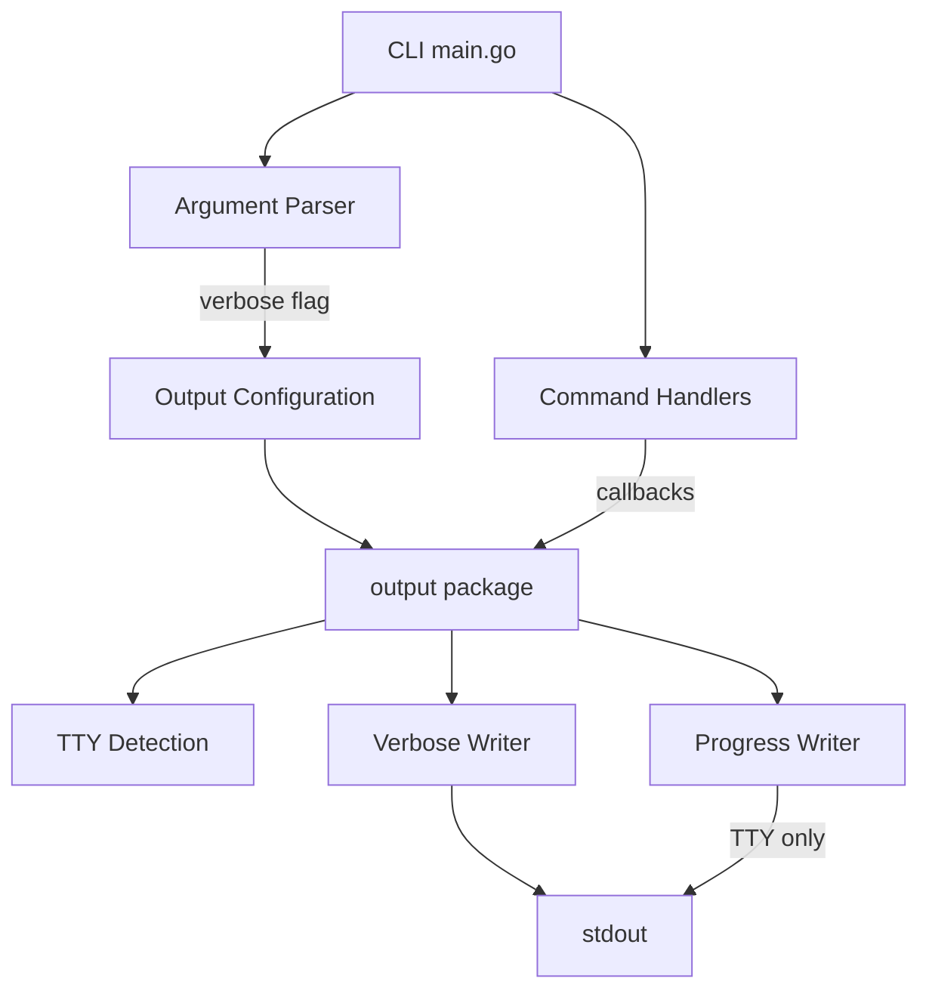

# Design Document: Verbose Output and Progress Indicators

## Overview

This design adds a global verbose flag (`-v`/`--verbose`) to the sorta CLI and a progress indicator for non-verbose mode. The implementation follows a clean separation between output formatting and business logic, using a new `output` package to handle all user-facing output.

## Architecture



## Components and Interfaces

### 1. Output Package (`internal/output`)

A new package that centralizes all user-facing output logic.

```go
// Package output handles CLI output formatting including verbose mode and progress indicators.
package output

import (
    "fmt"
    "io"
    "os"
    "sync"
)

// Config holds output configuration.
type Config struct {
    Verbose    bool      // Enable verbose output
    Writer     io.Writer // Output destination (default: os.Stdout)
    ErrWriter  io.Writer // Error output destination (default: os.Stderr)
    IsTTY      bool      // Whether output is a terminal
}

// Output handles formatted output with verbose and progress support.
type Output struct {
    config          Config
    progressActive  bool
    progressMu      sync.Mutex
    currentProgress string
}

// New creates a new Output instance with the given configuration.
func New(config Config) *Output

// DefaultConfig returns a Config with sensible defaults and TTY detection.
func DefaultConfig() Config

// Verbose prints a message only when verbose mode is enabled.
func (o *Output) Verbose(format string, args ...interface{})

// Info prints an informational message (always shown).
func (o *Output) Info(format string, args ...interface{})

// Error prints an error message to stderr.
func (o *Output) Error(format string, args ...interface{})

// StartProgress begins a progress indicator session.
func (o *Output) StartProgress(total int)

// UpdateProgress updates the progress indicator.
func (o *Output) UpdateProgress(current int, message string)

// EndProgress clears the progress indicator.
func (o *Output) EndProgress()
```

### 2. Extended Argument Parser

Extend `parseArgs` to handle the verbose flag:

```go
// ParseResult holds the result of parsing command line arguments.
type ParseResult struct {
    Command    string
    CmdArgs    []string
    ConfigPath string
    Verbose    bool  // NEW: verbose mode flag
}

// parseArgs parses command line arguments including global flags.
func parseArgs(args []string) (ParseResult, error)
```

### 3. Command Handler Updates

Each command handler receives an `*output.Output` instance:

```go
// runRunCommand executes the file organization workflow.
func runRunCommand(configPath string, out *output.Output) int

// runDiscoverCommand scans for prefix patterns.
func runDiscoverCommand(configPath string, args []string, out *output.Output) int

// runUndoCommand handles the undo command.
func runUndoCommand(args []string, out *output.Output) int
```

### 4. Orchestrator Callbacks

Add callback support to the orchestrator for progress reporting:

```go
// ProgressCallback is called during file processing.
type ProgressCallback func(current, total int, file string, result *Result)

// Options contains optional configuration for a Sorta run.
type Options struct {
    AuditConfig      *audit.AuditConfig
    AppVersion       string
    MachineID        string
    ProgressCallback ProgressCallback  // NEW: progress reporting callback
}
```

### 5. Discovery Callbacks

Add callback support to the discovery module:

```go
// DiscoveryCallback is called during discovery operations.
type DiscoveryCallback func(event DiscoveryEvent)

// DiscoveryEvent represents a discovery progress event.
type DiscoveryEvent struct {
    Type      string // "dir", "file", "pattern"
    Path      string
    Pattern   string // only for "pattern" type
    Current   int
    Total     int
}

// DiscoverWithCallback scans with progress reporting.
func DiscoverWithCallback(scanDir string, existingConfig *config.Configuration, callback DiscoveryCallback) (*DiscoveryResult, error)
```

## Data Models

### Output Configuration

```go
type Config struct {
    Verbose   bool      // Enable verbose output
    Writer    io.Writer // Output destination
    ErrWriter io.Writer // Error output destination  
    IsTTY     bool      // Terminal detection result
}
```

### Progress State

```go
type progressState struct {
    total   int
    current int
    active  bool
    message string
}
```

## Correctness Properties

*A property is a characteristic or behavior that should hold true across all valid executions of a system—essentially, a formal statement about what the system should do. Properties serve as the bridge between human-readable specifications and machine-verifiable correctness guarantees.*

### Property 1: Verbose Flag Parsing

*For any* command line containing `-v` or `--verbose` before the command, the parser SHALL correctly identify verbose mode as enabled, and for any command line without these flags, verbose mode SHALL be disabled.

**Validates: Requirements 1.1, 1.2**

### Property 2: Verbose Output Content for Run Command

*For any* file operation result (move, skip, review, error) processed during a run command with verbose mode enabled, the verbose output SHALL contain the relevant information for that result type: source path for all operations, destination path for moves, reason for skips and reviews, and error details for errors.

**Validates: Requirements 2.1, 2.2, 2.3, 2.4, 2.5**

### Property 3: Verbose Output Content for Discover Command

*For any* discovery operation with verbose mode enabled, the verbose output SHALL contain each scanned directory path, each analyzed file path, and each detected pattern as they are found.

**Validates: Requirements 3.1, 3.2, 3.3**

### Property 4: Verbose Output Content for Undo Command

*For any* undo operation with verbose mode enabled, the verbose output SHALL contain source and destination paths for restored files, skip reasons for files that cannot be restored, and verification status for file identity checks.

**Validates: Requirements 4.1, 4.2, 4.3**

### Property 5: Progress Indicator Format and Lifecycle

*For any* long-running command (run, discover, undo) executed in non-verbose mode on a TTY, the progress indicator SHALL display in the format "Processing file N/M..." (or similar), use carriage return for in-place updates, and be cleared before the final summary is displayed.

**Validates: Requirements 5.1, 5.2, 5.3, 5.4, 5.5, 5.6**

### Property 6: TTY Detection Behavior

*For any* command execution, when stdout is not a TTY, progress indicators SHALL be suppressed; when verbose mode is enabled, verbose output SHALL appear regardless of TTY status; and final summaries SHALL always appear regardless of TTY status.

**Validates: Requirements 6.1, 6.2, 6.3**

## Error Handling

### TTY Detection Failures

If TTY detection fails, default to non-TTY behavior (suppress progress indicators). This is the safer default for scripted usage.

### Output Write Failures

If writing to stdout/stderr fails:
- Log the error to stderr if possible
- Continue processing (don't fail the entire operation due to output issues)
- Return appropriate exit code based on actual operation success

### Progress State Corruption

Use mutex protection for progress state to prevent race conditions in concurrent scenarios. If progress state becomes inconsistent, reset to a clean state.

## Testing Strategy

### Unit Tests

Unit tests verify specific examples and edge cases:

1. **Argument parsing edge cases**: Empty args, multiple flags, flag variations (`-v`, `--verbose`, `-v=true`)
2. **TTY detection mocking**: Test behavior with mocked TTY/non-TTY states
3. **Progress format validation**: Verify exact output format matches specification
4. **Verbose output format**: Verify output contains required information

### Property-Based Tests

Property-based tests verify universal properties across all inputs using the `gopter` library with minimum 100 iterations per test:

1. **Property 1**: Generate random command lines with/without verbose flags, verify parsing correctness
2. **Property 2**: Generate random operation results, verify verbose output contains required fields
3. **Property 5**: Generate random file counts, verify progress format matches pattern
4. **Property 6**: Generate random TTY states and verbose flags, verify output behavior

Each property test must be tagged with:
```go
// Feature: verbose-progress, Property N: [property description]
```

### Integration Tests

Integration tests verify end-to-end behavior:

1. Run sorta with `-v` flag and verify verbose output appears
2. Run sorta without `-v` and verify progress indicator appears (TTY simulation)
3. Run sorta in pipe mode and verify progress is suppressed
