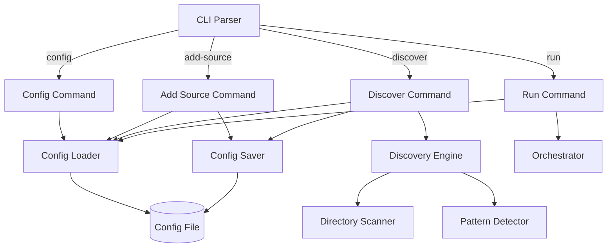

# Design Document: Config Auto-Discover

## Overview

This design extends Sorta with configuration management commands and auto-discovery capabilities. The implementation adds a subcommand-based CLI structure, default config file handling, and a discovery engine that analyzes existing file structures to generate prefix rules automatically.

Key changes from the existing architecture:
1. CLI refactored to use subcommands (`config`, `add-source`, `discover`, `run`)
2. Default config file location (`sorta-config.json`) with `-c/--config` override
3. For-review directory becomes a per-source-directory subdirectory
4. New discovery module for pattern detection
5. Duplicate file handling with `_duplicate` suffix

## Architecture



## Components and Interfaces

### CLI Module (`cmd/sorta/main.go`)

Refactored to support subcommands with a global config flag.

```go
// Command structure
type CLI struct {
    ConfigPath string // -c, --config flag, defaults to "sorta-config.json"
}

// Subcommands:
// - config: Display current configuration
// - add-source <directory>: Add a source directory
// - discover <scan-directory>: Auto-discover prefix rules
// - run: Execute file organization (existing behavior)

func parseArgs(args []string) (command string, cmdArgs []string, configPath string, err error)
```

### Config Module Updates (`internal/config/config.go`)

Updated configuration structure removing global forReviewDirectory.

```go
// Configuration holds all settings for Sorta (updated)
type Configuration struct {
    SourceDirectories []string     `json:"sourceDirectories"`
    PrefixRules       []PrefixRule `json:"prefixRules"`
    // ForReviewDirectory removed - now per-source subdirectory
}

// LoadOrCreate loads config if exists, or returns empty config
func LoadOrCreate(filePath string) (*Configuration, error)

// HasPrefix checks if a prefix already exists (case-insensitive)
func (c *Configuration) HasPrefix(prefix string) bool

// AddPrefixRule adds a rule if prefix doesn't already exist
func (c *Configuration) AddPrefixRule(rule PrefixRule) bool

// HasSourceDirectory checks if directory already exists
func (c *Configuration) HasSourceDirectory(dir string) bool

// AddSourceDirectory adds a directory if not duplicate
func (c *Configuration) AddSourceDirectory(dir string) bool
```

### Discovery Module (`internal/discovery/discovery.go`)

New module for auto-discovering prefix rules from existing directories.

```go
// DiscoveredRule represents a prefix rule found during discovery
type DiscoveredRule struct {
    Prefix          string
    TargetDirectory string
}

// DiscoveryResult contains the results of a discovery scan
type DiscoveryResult struct {
    NewRules     []DiscoveredRule
    SkippedRules []DiscoveredRule // Already in config
    ScannedDirs  int
    FilesAnalyzed int
}

// Discover scans a directory and returns discovered prefix rules
func Discover(scanDir string, existingConfig *Configuration) (*DiscoveryResult, error)

// scanTargetCandidates finds immediate subdirectories
func scanTargetCandidates(scanDir string) ([]string, error)

// analyzeDirectory recursively scans files for prefix patterns
func analyzeDirectory(dir string) ([]string, error)

// extractPrefix extracts prefix from filename if it matches pattern
func extractPrefix(filename string) (string, bool)
```

### Pattern Detector (`internal/discovery/pattern.go`)

Handles detection of the `<prefix> <ISO_Date> <other_info>` pattern.

```go
// PrefixPattern represents the regex for detecting file patterns
// Pattern: ^([A-Za-z][A-Za-z0-9]*)\s+(\d{4}-\d{2}-\d{2})\s+(.+)$
var PrefixPattern = regexp.MustCompile(`^([A-Za-z][A-Za-z0-9]*)\s+(\d{4}-\d{2}-\d{2})\s+(.+)$`)

// ExtractPrefixFromFilename returns the prefix if filename matches pattern
func ExtractPrefixFromFilename(filename string) (prefix string, matched bool)
```

### Duplicate Handler (`internal/organizer/duplicate.go`)

Handles duplicate file naming.

```go
// GenerateDuplicateName creates a unique filename for duplicates
// "file.pdf" -> "file_duplicate.pdf"
// "file_duplicate.pdf" -> "file_duplicate_2.pdf"
func GenerateDuplicateName(destDir, filename string) string

// FileExists checks if a file exists at the given path
func FileExists(path string) bool
```

### For-Review Path Generator

```go
// GetForReviewPath returns the for-review subdirectory for a source directory
func GetForReviewPath(sourceDir string) string {
    return filepath.Join(sourceDir, "for-review")
}
```

## Data Models

### Configuration (Updated)

```json
{
  "sourceDirectories": [
    "/path/to/source1",
    "/path/to/source2"
  ],
  "prefixRules": [
    { "prefix": "Invoice", "targetDirectory": "/path/to/invoices" },
    { "prefix": "Receipt", "targetDirectory": "/path/to/receipts" }
  ]
}
```

Note: `forReviewDirectory` is removed. Each source directory will have a `for-review` subdirectory created automatically.

### Discovery Result

```go
type DiscoveryResult struct {
    NewRules      []DiscoveredRule // Rules to be added
    SkippedRules  []DiscoveredRule // Rules skipped (duplicate prefix)
    ScannedDirs   int              // Number of directories scanned
    FilesAnalyzed int              // Number of files analyzed
}
```

### Duplicate File Naming

Original: `Invoice 2024-01-15 Acme Corp.pdf`
If exists: `Invoice 2024-01-15 Acme Corp_duplicate.pdf`
If that exists: `Invoice 2024-01-15 Acme Corp_duplicate_2.pdf`


## Correctness Properties

*A property is a characteristic or behavior that should hold true across all valid executions of a system—essentially, a formal statement about what the system should do. Properties serve as the bridge between human-readable specifications and machine-verifiable correctness guarantees.*

### Property 1: Config Flag Parsing

*For any* valid file path provided with the `-c` or `--config` flag, the CLI parser SHALL extract and return that exact path as the config file location.

**Validates: Requirements 1.2**

### Property 2: Config Display Completeness

*For any* valid Configuration object, displaying the configuration SHALL produce output that contains every source directory path and every prefix rule (prefix and target directory) from the configuration.

**Validates: Requirements 2.2, 2.3**

### Property 3: Source Directory Duplicate Prevention

*For any* Configuration and any directory path that already exists in sourceDirectories, calling AddSourceDirectory with that path SHALL not modify the sourceDirectories array.

**Validates: Requirements 3.4**

### Property 4: Candidate Directory Detection

*For any* directory structure, scanning for target directory candidates SHALL return only immediate child directories of the scan directory, and SHALL include a directory if and only if it contains at least one file matching the prefix pattern (at any depth within that directory).

**Validates: Requirements 5.1, 5.2, 5.3**

### Property 5: Recursive File Analysis

*For any* target directory candidate with nested subdirectories, analyzing that directory SHALL examine all files at all depths within the directory structure.

**Validates: Requirements 6.1**

### Property 6: Prefix Extraction

*For any* filename, the prefix extraction function SHALL return a prefix if and only if the filename matches the pattern `<prefix> <YYYY-MM-DD> <other_info>` where prefix starts with a letter, is followed by alphanumeric characters, and is separated from the date by exactly one space. Multiple distinct prefixes within the same directory SHALL all be detected.

**Validates: Requirements 6.2, 6.3, 6.4**

### Property 7: Prefix Rule Duplicate Prevention

*For any* Configuration with existing prefix rules and any discovered prefix that matches an existing prefix (case-insensitively), adding the discovered rule SHALL skip the duplicate and preserve all existing rules unchanged.

**Validates: Requirements 7.3, 7.4, 7.5**

### Property 8: Discovery Output Completeness

*For any* DiscoveryResult, the output display SHALL contain all new rules (prefix and target directory) and all skipped rules with indication they were already configured.

**Validates: Requirements 8.2, 8.4**

### Property 9: For-Review Path Generation

*For any* source directory path, the for-review path SHALL be the `for-review` subdirectory within that source directory, and unclassified files from that source SHALL be moved to that specific for-review subdirectory.

**Validates: Requirements 9.1, 9.3**

### Property 10: Duplicate File Naming

*For any* file being moved to a destination where a file with the same name exists, the system SHALL generate a unique filename by appending `_duplicate` (or `_duplicate_N` for subsequent duplicates) before the file extension, and SHALL successfully move the file with the new name.

**Validates: Requirements 10.1, 10.2, 10.3, 10.4, 10.5**

### Property 11: Configuration Round-Trip

*For any* valid Configuration object, serializing to JSON then parsing back SHALL produce a Configuration object equivalent to the original.

**Validates: Requirements 11.2**

## Error Handling

### CLI Errors

| Error Condition | Behavior |
|----------------|----------|
| Unknown command | Display usage and exit with error code |
| Missing required argument | Display command-specific usage and exit with error code |
| Invalid flag format | Display error message and usage |

### Configuration Errors

| Error Condition | Behavior |
|----------------|----------|
| Config file not found (for commands requiring it) | Display error: "Configuration file not found: <path>" |
| Invalid JSON in config | Display error: "Invalid JSON in configuration: <details>" |
| Config validation failure | Display specific validation error |

### Discovery Errors

| Error Condition | Behavior |
|----------------|----------|
| Scan directory does not exist | Display error and exit |
| Permission denied on directory | Log warning, skip directory, continue |
| No patterns found | Display informational message, exit successfully |

### File Operation Errors

| Error Condition | Behavior |
|----------------|----------|
| Cannot create directory | Log error, skip file, continue |
| Cannot move file | Log error, continue with next file |
| Cannot write config | Display error and exit with error code |

## Testing Strategy

### Property-Based Testing

Property-based tests will use the `gopter` library for Go. Each property test will run a minimum of 100 iterations.

**Test Configuration:**
```go
parameters := gopter.DefaultTestParameters()
parameters.MinSuccessfulTests = 100
```

**Properties to implement:**
1. Config flag parsing - generate random valid paths
2. Config display completeness - generate random configurations
3. Source directory duplicate prevention - generate configs with existing directories
4. Candidate directory detection - generate directory structures
5. Prefix extraction - generate filenames with various patterns
6. Prefix rule duplicate prevention - generate configs with existing rules
7. Discovery output completeness - generate discovery results
8. For-review path generation - generate source directory paths
9. Duplicate file naming - generate existing file scenarios
10. Configuration round-trip - generate random valid configurations

### Unit Tests

Unit tests complement property tests for specific examples and edge cases:

**CLI Parsing:**
- Default config path when no flag provided
- Config path with `-c` flag
- Config path with `--config` flag
- Error on unknown command
- Error on missing arguments

**Configuration:**
- Load existing valid config
- Error on missing config file
- Error on invalid JSON
- Create new config when file doesn't exist

**Discovery:**
- Skip directories with no matching files
- Detect single prefix in directory
- Detect multiple prefixes in same directory
- Handle nested directory structures
- Skip already-configured prefixes

**Duplicate Handling:**
- First duplicate gets `_duplicate` suffix
- Second duplicate gets `_duplicate_2` suffix
- Handle files without extensions
- Handle files with multiple dots in name

### Test File Organization

```
internal/
  config/
    config_test.go        # Config unit tests
    config_prop_test.go   # Config property tests
  discovery/
    discovery_test.go     # Discovery unit tests
    discovery_prop_test.go # Discovery property tests
    pattern_test.go       # Pattern detection tests
  organizer/
    duplicate_test.go     # Duplicate handling tests
    duplicate_prop_test.go # Duplicate property tests
cmd/
  sorta/
    main_test.go          # CLI parsing tests
```
