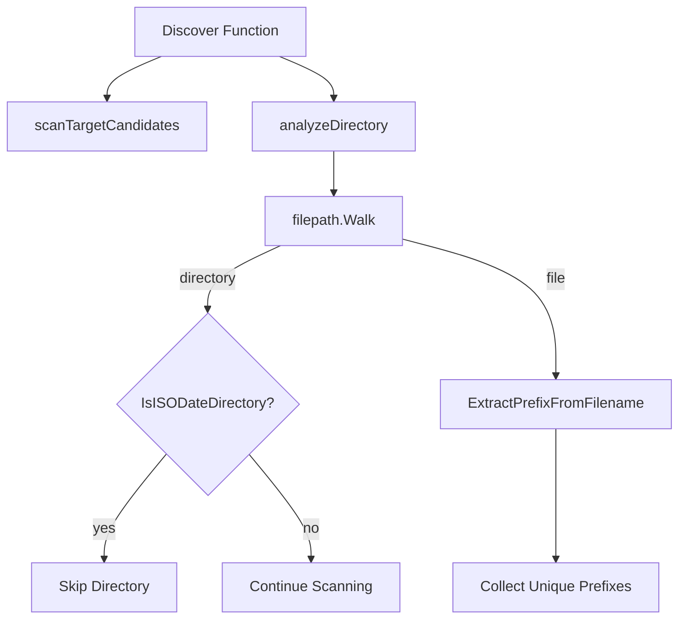

# Design Document: Discovery Directory Filtering

## Overview

This design refines the existing discovery engine to improve prefix detection accuracy. The key changes are:

1. Ensure prefixes are extracted only from files, not directory names
2. Skip directories that start with ISO dates (YYYY-MM-DD) during recursive scanning
3. Maintain recursive scanning into non-ISO-date subdirectories

These changes prevent false positives from directory names that happen to match the prefix pattern and avoid scanning into date-organized folder structures that don't contain useful prefix information.

## Architecture

The changes are localized to the discovery module. No new components are needed.



## Components and Interfaces

### Pattern Detection Updates (`internal/discovery/pattern.go`)

Add a function to detect ISO-date directories:

```go
// ISODateDirPattern matches directory names starting with YYYY-MM-DD
var ISODateDirPattern = regexp.MustCompile(`^\d{4}-(0[1-9]|1[0-2])-(0[1-9]|[12]\d|3[01])`)

// IsISODateDirectory returns true if the directory name starts with an ISO date
func IsISODateDirectory(dirName string) bool
```

### Discovery Engine Updates (`internal/discovery/discovery.go`)

Update `analyzeDirectory` to:
1. Skip directories starting with ISO dates
2. Only extract prefixes from files (already the case, but ensure no directory name extraction)

```go
// analyzeDirectoryWithCallback recursively scans all files within a directory
// and returns unique prefixes found using pattern detection.
// It skips subdirectories whose names start with an ISO date (YYYY-MM-DD).
// Prefixes are extracted only from files, never from directory names.
func analyzeDirectoryWithCallback(dir string, callback DiscoveryCallback, fileCounter *int) ([]string, error)
```

## Data Models

No changes to data models. The `DiscoveredRule` and `DiscoveryResult` types remain unchanged.

## Correctness Properties

*A property is a characteristic or behavior that should hold true across all valid executions of a system—essentially, a formal statement about what the system should do. Properties serve as the bridge between human-readable specifications and machine-verifiable correctness guarantees.*

### Property 1: File-Only Prefix Extraction

*For any* directory structure containing both files and directories that match the prefix pattern, the discovery engine SHALL return prefixes extracted only from files. Directory names matching the prefix pattern SHALL NOT appear in the discovered prefixes.

**Validates: Requirements 1.1, 1.2, 1.3**

### Property 2: ISO-Date Directory Filtering

*For any* directory structure containing subdirectories that start with ISO dates (YYYY-MM-DD), files within those ISO-date subdirectories SHALL NOT be analyzed for prefix extraction. Files in non-ISO-date subdirectories SHALL be analyzed normally.

**Validates: Requirements 2.1, 2.2, 3.1, 3.2, 3.3**

### Property 3: ISO Date Pattern Detection

*For any* directory name, the `IsISODateDirectory` function SHALL return true if and only if the name starts with a valid ISO date pattern (YYYY-MM-DD where MM is 01-12 and DD is 01-31).

**Validates: Requirements 2.3**

## Error Handling

No new error conditions. The existing error handling in the discovery module remains unchanged:

| Error Condition | Behavior |
|----------------|----------|
| Permission denied on directory | Log warning, skip directory, continue |
| Cannot read directory | Skip directory, continue with others |

## Testing Strategy

### Property-Based Testing

Property-based tests will use the `gopter` library for Go. Each property test will run a minimum of 100 iterations.

**Test Configuration:**
```go
parameters := gopter.DefaultTestParameters()
parameters.MinSuccessfulTests = 100
```

**Properties to implement:**

1. **File-only prefix extraction**: Generate directory structures with both files and directories matching the prefix pattern. Verify discovered prefixes come only from files.

2. **ISO-date directory filtering**: Generate directory structures with ISO-date-prefixed subdirectories containing files. Verify those files are not analyzed.

3. **ISO date pattern detection**: Generate directory names with various patterns. Verify correct classification as ISO-date or non-ISO-date directories.

### Unit Tests

Unit tests complement property tests for specific examples and edge cases:

**ISO Date Directory Detection:**
- `2024-01-15` → true (valid ISO date)
- `2024-01-15 Some Folder` → true (starts with ISO date)
- `Invoice 2024-01-15` → false (doesn't start with date)
- `2024-13-01` → false (invalid month)
- `2024-01-32` → false (invalid day)
- `20240115` → false (no dashes)

**Directory Filtering:**
- Files in root of target candidate are analyzed
- Files in non-ISO-date subdirectories are analyzed
- Files in ISO-date subdirectories are skipped
- Nested ISO-date directories are skipped

**Prefix Source:**
- Directory named "Invoice 2024-01-15 Vendor" doesn't produce "Invoice" prefix
- File named "Invoice 2024-01-15 Vendor.pdf" produces "Invoice" prefix

### Test File Organization

```
internal/
  discovery/
    pattern_test.go       # Add IsISODateDirectory tests
    discovery_test.go     # Add directory filtering tests
```
