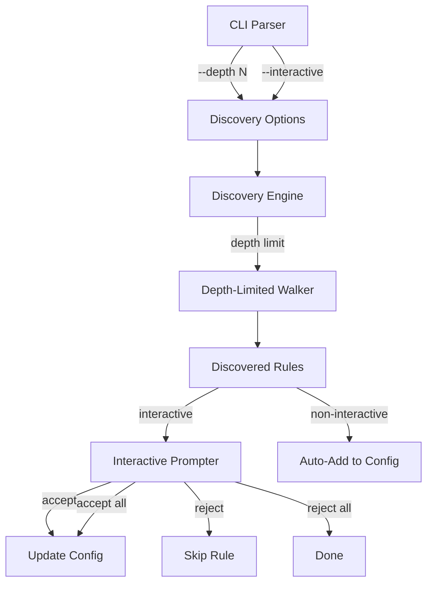

# Design Document: Discovery Enhancements

## Overview

This design enhances the discovery command with two new capabilities:
1. Depth limiting to prevent accidental deep crawls of nested directory structures
2. Interactive mode for fine-grained control over which discovered rules to accept

## Architecture

The changes extend the existing discovery module with depth tracking and add an interactive prompt handler.



## Components and Interfaces

### Discovery Options (`internal/discovery/discovery.go`)

Extend discovery with options:

```go
// DiscoverOptions configures the discovery operation
type DiscoverOptions struct {
    MaxDepth    int   // -1 for unlimited, 0 for immediate only, N for N levels
    Interactive bool  // Whether to prompt for each rule
}

// DiscoverWithOptions scans with configurable depth and interactivity
func DiscoverWithOptions(scanDir string, existingConfig *config.Configuration, 
    opts DiscoverOptions, callback DiscoveryCallback) (*DiscoveryResult, error)
```

### Depth-Limited Walker (`internal/discovery/discovery.go`)

Update the directory walker to respect depth:

```go
// analyzeDirectoryWithDepth recursively scans files up to maxDepth levels
// maxDepth of -1 means unlimited, 0 means immediate directory only
func analyzeDirectoryWithDepth(dir string, maxDepth int, callback DiscoveryCallback, 
    fileCounter *int) ([]string, error)
```

### Interactive Prompter (`internal/discovery/interactive.go`)

New component for interactive rule selection:

```go
// InteractivePrompter handles user prompts for rule selection
type InteractivePrompter struct {
    reader io.Reader
    writer io.Writer
}

// PromptResult represents the user's choice
type PromptResult int

const (
    PromptAccept PromptResult = iota
    PromptReject
    PromptAcceptAll
    PromptRejectAll
    PromptQuit
)

// PromptForRule asks the user whether to accept a discovered rule
func (p *InteractivePrompter) PromptForRule(rule DiscoveredRule) (PromptResult, error)

// IsInteractive returns true if the terminal supports interactive input
func IsInteractive() bool
```

### CLI Updates (`cmd/sorta/main.go`)

Add new flags:

```go
// sorta discover --depth N /path/to/scan
// sorta discover --interactive /path/to/scan
// sorta discover --depth 2 --interactive /path/to/scan
```

## Data Models

### DiscoverOptions

```go
type DiscoverOptions struct {
    MaxDepth    int   // -1 = unlimited, 0 = immediate, N = N levels deep
    Interactive bool  // Prompt for each rule
}
```

### PromptResult

```go
type PromptResult int

const (
    PromptAccept    PromptResult = iota  // Accept this rule
    PromptReject                          // Reject this rule
    PromptAcceptAll                       // Accept all remaining
    PromptRejectAll                       // Reject all remaining
    PromptQuit                            // Quit without saving
)
```

## Correctness Properties

*A property is a characteristic or behavior that should hold true across all valid executions of a system—essentially, a formal statement about what the system should do. Properties serve as the bridge between human-readable specifications and machine-verifiable correctness guarantees.*

### Property 1: Depth Limiting Correctness

*For any* directory structure with files at various depths and any depth limit N >= 0, the discovery engine SHALL only analyze files at depth <= N within each target candidate. Files at depth > N SHALL NOT produce prefixes in the results.

**Validates: Requirements 1.1, 1.3, 1.4, 1.6**

### Property 2: Unlimited Depth Default

*For any* directory structure with deeply nested files, when no depth limit is specified (default), the discovery engine SHALL analyze files at all depths and return prefixes from all levels.

**Validates: Requirements 1.2**

### Property 3: ISO-Date Skip at All Depths

*For any* directory structure containing ISO-date directories at various depths, the discovery engine SHALL skip those directories regardless of the configured depth limit.

**Validates: Requirements 1.5**

### Property 4: Interactive Prompt Content

*For any* discovered rule in interactive mode, the prompt SHALL display the prefix and target directory before requesting user input.

**Validates: Requirements 2.1, 2.2**

### Property 5: Interactive Accept/Reject Behavior

*For any* discovered rule, accepting SHALL add it to the configuration and rejecting SHALL leave the configuration unchanged for that rule.

**Validates: Requirements 2.3, 2.4**

### Property 6: Non-Interactive Auto-Add

*For any* discovery run without interactive mode, all discovered rules SHALL be automatically added to the configuration.

**Validates: Requirements 2.6**

### Property 7: Combined Flags Behavior

*For any* discovery run with both --depth and --interactive flags, the depth limit SHALL be applied first to filter results, then interactive prompts SHALL be shown only for the depth-limited results.

**Validates: Requirements 3.1, 3.2**

## Error Handling

| Error Condition | Behavior |
|----------------|----------|
| Invalid depth value | Return error with usage message |
| Non-interactive terminal with --interactive | Fall back to non-interactive with warning |
| User quits interactive mode | Save accepted rules, discard pending |
| Read error during prompt | Return error, save accepted rules |

## Testing Strategy

### Property-Based Testing

Property-based tests will use the `gopter` library. Each test runs minimum 100 iterations.

**Properties to implement:**

1. **Depth limiting**: Generate nested structures, verify only files at correct depth analyzed
2. **Unlimited default**: Generate deep structures, verify all files found without --depth
3. **ISO-date skip**: Generate structures with ISO-date dirs at various depths
4. **Prompt content**: Verify prompts contain prefix and directory
5. **Accept/reject**: Simulate inputs, verify config changes
6. **Non-interactive**: Verify all rules added without prompts
7. **Combined flags**: Verify depth applied before interactive

### Unit Tests

- Depth 0 (immediate only)
- Depth 1 (one level)
- Depth with ISO-date directories
- Interactive accept single rule
- Interactive reject single rule
- Interactive accept all
- Interactive reject all
- Non-TTY fallback
