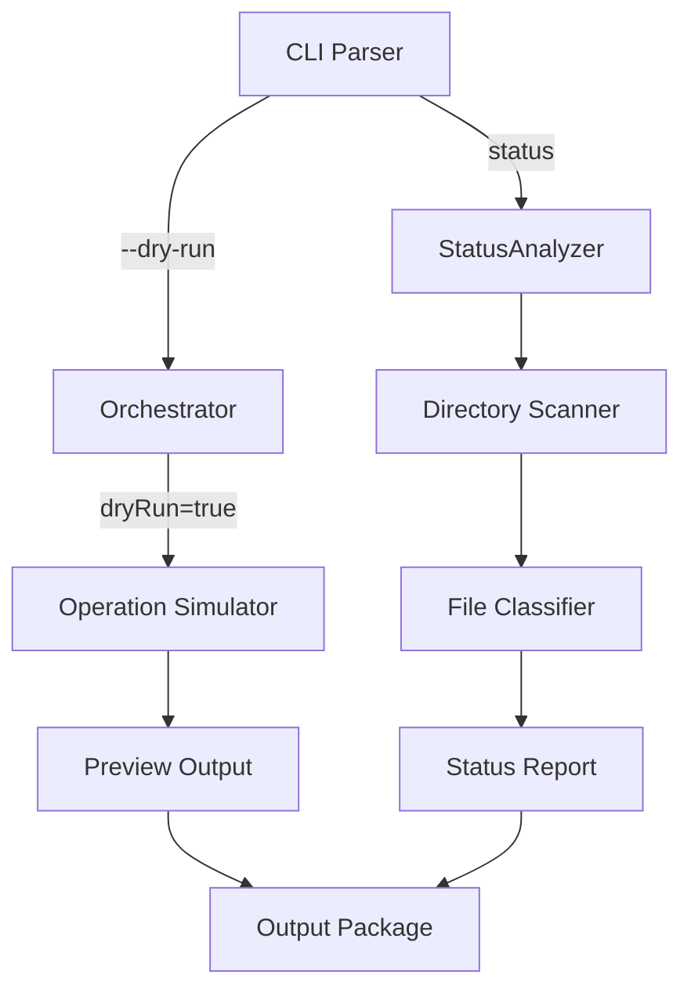

# Design Document: Dry Run Preview

## Overview

This design adds preview capabilities to Sorta through two mechanisms:
1. A `--dry-run` flag for the run command that simulates operations without modifying files
2. A `status` command that shows pending files across all inbound directories

Both features share the core principle of read-only operation - they analyze what would happen without making changes.

## Architecture

The changes build on the existing orchestrator by adding a dry-run mode flag and a new status analyzer component.



## Components and Interfaces

### Orchestrator Updates (`internal/orchestrator/orchestrator.go`)

Add dry-run mode to the orchestrator:

```go
// RunOptions configures the run operation
type RunOptions struct {
    DryRun  bool
    Verbose bool
}

// RunResult contains the results of a run operation
type RunResult struct {
    Moved      []FileOperation
    ForReview  []FileOperation
    Skipped    []FileOperation
    Errors     []error
}

// FileOperation represents a planned or executed file operation
type FileOperation struct {
    Source      string
    Destination string
    Prefix      string  // empty for for-review files
    Reason      string  // why skipped, if applicable
}

// Run executes or simulates file organization based on options
func (o *Orchestrator) Run(opts RunOptions) (*RunResult, error)
```

### Status Analyzer (`internal/orchestrator/status.go`)

New component for status reporting:

```go
// StatusResult contains the status analysis results
type StatusResult struct {
    ByInbound    map[string]*InboundStatus
    GrandTotal   int
}

// InboundStatus contains status for one inbound directory
type InboundStatus struct {
    Directory    string
    ByDestination map[string][]string  // destination -> list of files
    Total        int
}

// Status analyzes pending files without modifying anything
func (o *Orchestrator) Status() (*StatusResult, error)
```

### CLI Updates (`cmd/sorta/main.go`)

Add new flag and command:

```go
// Add --dry-run flag to run command
// sorta run --dry-run

// Add status command
// sorta status
```

### Output Formatting (`internal/output/output.go`)

Add preview output methods:

```go
// PrintDryRunResult formats and prints dry-run results
func (o *Output) PrintDryRunResult(result *RunResult)

// PrintStatusResult formats and prints status results
func (o *Output) PrintStatusResult(result *StatusResult)

// PrintSummary prints operation summary counts
func (o *Output) PrintSummary(moved, forReview, skipped int)
```

## Data Models

### FileOperation

```go
type FileOperation struct {
    Source      string  // Original file path
    Destination string  // Where it would go
    Prefix      string  // Matched prefix (empty for for-review)
    Reason      string  // Skip reason if applicable
}
```

### RunResult

```go
type RunResult struct {
    Moved     []FileOperation  // Files that would be/were moved
    ForReview []FileOperation  // Files going to for-review
    Skipped   []FileOperation  // Files skipped
    Errors    []error          // Errors encountered
}
```

## Correctness Properties

*A property is a characteristic or behavior that should hold true across all valid executions of a system—essentially, a formal statement about what the system should do. Properties serve as the bridge between human-readable specifications and machine-verifiable correctness guarantees.*

### Property 1: Dry-Run Filesystem Immutability

*For any* configuration and set of files in inbound directories, running `sorta run --dry-run` SHALL NOT modify any files, create any directories, or write to the audit log. The filesystem state after dry-run SHALL be identical to the state before.

**Validates: Requirements 1.1, 1.4, 1.5, 2.6**

### Property 2: Dry-Run Output Completeness

*For any* set of files in inbound directories, the dry-run output SHALL contain an entry for every file showing its source path and planned destination path (either organized location or for-review).

**Validates: Requirements 1.2, 1.3, 3.1**

### Property 3: Status Grouping and Counts

*For any* configuration with multiple inbound directories containing files, the status output SHALL correctly group files by destination, show accurate per-directory counts, and display a grand total equal to the sum of all per-directory counts.

**Validates: Requirements 2.2, 2.3, 2.4, 3.2**

### Property 4: Summary Count Accuracy

*For any* dry-run execution, the summary counts (moved, for-review, skipped) SHALL equal the actual number of files in each category from the detailed output.

**Validates: Requirements 1.6**

### Property 5: Verbose Mode Additional Detail

*For any* dry-run execution with verbose mode enabled, the output SHALL contain rule matching details that are not present in non-verbose output.

**Validates: Requirements 3.4**

## Error Handling

| Error Condition | Behavior |
|----------------|----------|
| Inbound directory doesn't exist | Report error, continue with other directories |
| Permission denied on file | Report in skipped list with reason |
| Invalid configuration | Return error before processing |

## Testing Strategy

### Property-Based Testing

Property-based tests will use the `gopter` library. Each test runs minimum 100 iterations.

**Properties to implement:**

1. **Filesystem immutability**: Generate random file structures, run dry-run, verify no changes
2. **Output completeness**: Generate files, verify all appear in output with correct destinations
3. **Grouping and counts**: Generate multi-directory structures, verify counts match
4. **Summary accuracy**: Verify summary counts match detailed output
5. **Verbose detail**: Compare verbose vs non-verbose output

### Unit Tests

- Dry-run with matching files
- Dry-run with for-review files
- Dry-run with mixed files
- Status with empty directories
- Status with multiple inbound directories
- Summary formatting
