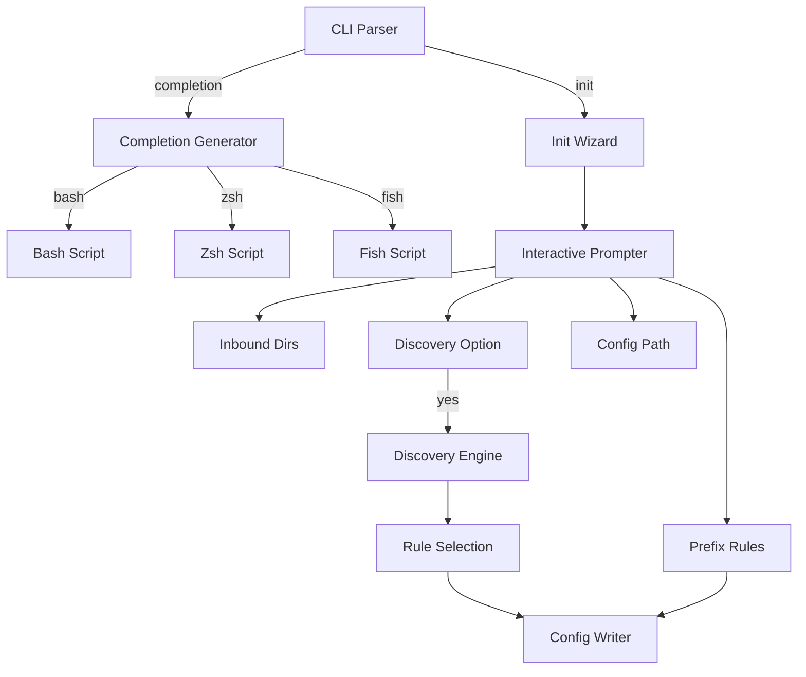

# Design Document: Shell Completions and Init Wizard

## Overview

This design improves the onboarding experience for Sorta with:
1. Shell completion scripts for bash, zsh, and fish
2. An interactive `init` command that guides users through initial setup

## Architecture

The changes add a completion generator and an interactive init wizard.



## Components and Interfaces

### Completion Generator (`internal/completion/completion.go`)

New component for generating shell completions:

```go
// Generator creates shell completion scripts
type Generator struct {
    commands []CommandInfo
    flags    []FlagInfo
}

// CommandInfo describes a command for completion
type CommandInfo struct {
    Name        string
    Description string
    Subcommands []CommandInfo
}

// FlagInfo describes a flag for completion
type FlagInfo struct {
    Short       string
    Long        string
    Description string
    TakesFile   bool  // Whether it expects a file path
}

// GenerateBash outputs bash completion script
func (g *Generator) GenerateBash(w io.Writer) error

// GenerateZsh outputs zsh completion script
func (g *Generator) GenerateZsh(w io.Writer) error

// GenerateFish outputs fish completion script
func (g *Generator) GenerateFish(w io.Writer) error
```

### Init Wizard (`internal/init/wizard.go`)

New component for interactive setup:

```go
// Wizard handles interactive initialization
type Wizard struct {
    reader io.Reader
    writer io.Writer
    config *config.Configuration
}

// WizardResult contains the wizard output
type WizardResult struct {
    ConfigPath string
    Config     *config.Configuration
    Created    bool  // true if new file, false if merged
}

// Run executes the interactive wizard
func (w *Wizard) Run() (*WizardResult, error)

// PromptInboundDirs asks for inbound directories
func (w *Wizard) PromptInboundDirs() ([]string, error)

// PromptPrefixRules asks for prefix rules or offers discovery
func (w *Wizard) PromptPrefixRules() ([]config.PrefixRule, error)

// PromptConfigPath asks where to save the config
func (w *Wizard) PromptConfigPath() (string, error)

// PromptDiscovery offers to run discovery and select rules
func (w *Wizard) PromptDiscovery() ([]config.PrefixRule, error)
```

### CLI Updates (`cmd/sorta/main.go`)

Add new commands:

```go
// sorta completion bash
// sorta completion zsh
// sorta completion fish
// sorta completion --help

// sorta init
```

## Data Models

### CommandInfo

```go
type CommandInfo struct {
    Name        string        // Command name (e.g., "run")
    Description string        // Help text
    Subcommands []CommandInfo // Nested commands (e.g., audit list)
}
```

### FlagInfo

```go
type FlagInfo struct {
    Short       string  // Short flag (e.g., "c")
    Long        string  // Long flag (e.g., "config")
    Description string  // Help text
    TakesFile   bool    // Expects file path argument
}
```

### WizardResult

```go
type WizardResult struct {
    ConfigPath string                 // Where config was saved
    Config     *config.Configuration  // The created config
    Created    bool                   // New file vs merged
}
```

## Correctness Properties

*A property is a characteristic or behavior that should hold true across all valid executions of a system—essentially, a formal statement about what the system should do. Properties serve as the bridge between human-readable specifications and machine-verifiable correctness guarantees.*

### Property 1: Completion Script Validity

*For any* supported shell (bash, zsh, fish), the generated completion script SHALL be syntactically valid for that shell and contain completion definitions.

**Validates: Requirements 1.1, 1.2, 1.3**

### Property 2: Completion Coverage

*For any* generated completion script, it SHALL include completions for all subcommands (run, config, discover, audit, undo, init, completion), all flags (--config, --verbose, --dry-run, --depth, etc.), and file path completion for path arguments.

**Validates: Requirements 1.4, 1.5, 1.6**

### Property 3: Init Wizard Prompts

*For any* init wizard execution, the wizard SHALL prompt for inbound directories, prefix rules (or discovery option), and configuration file location.

**Validates: Requirements 3.2, 3.3, 3.4**

### Property 4: Init Config Creation

*For any* completed init wizard, the wizard SHALL create a valid configuration file with the provided settings. If a config already exists, the wizard SHALL prompt for overwrite or merge.

**Validates: Requirements 3.5, 3.6**

### Property 5: Init Discovery Integration

*For any* init wizard where user chooses discovery, the wizard SHALL prompt for a directory to scan, display discovered rules, allow selection, and add selected rules to the configuration.

**Validates: Requirements 4.1, 4.2, 4.3, 4.4**

## Error Handling

| Error Condition | Behavior |
|----------------|----------|
| Invalid shell name | Display error with supported shells |
| Non-interactive terminal for init | Display error message |
| Config file exists | Prompt for overwrite/merge |
| Discovery finds no rules | Display message, continue with manual entry |
| Write permission denied | Display error with path |

## Testing Strategy

### Property-Based Testing

Property-based tests will use the `gopter` library. Each test runs minimum 100 iterations.

**Properties to implement:**

1. **Completion validity**: Generate scripts, verify syntax
2. **Completion coverage**: Verify all commands and flags present
3. **Wizard prompts**: Simulate wizard, verify all prompts occur
4. **Config creation**: Simulate wizard, verify config created correctly
5. **Discovery integration**: Simulate discovery flow, verify rules added

### Unit Tests

- Bash completion output
- Zsh completion output
- Fish completion output
- Invalid shell error
- Completion help text
- Init with new config
- Init with existing config (overwrite)
- Init with existing config (merge)
- Init with discovery
- Init non-interactive error
