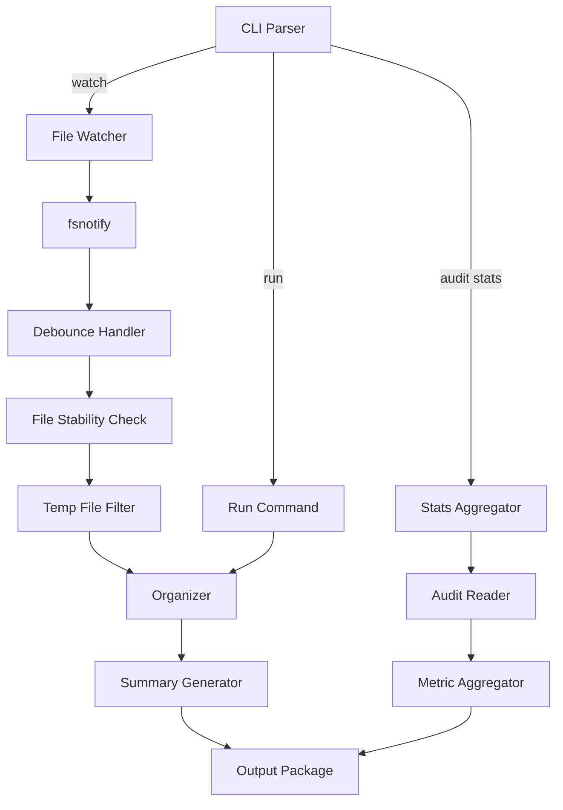

# Design Document: Watch Mode

## Overview

This design adds continuous monitoring and statistics capabilities to Sorta:
1. Watch mode for automatic file organization as files arrive
2. Run summary statistics after each operation
3. Aggregate audit statistics across all runs

## Architecture

The changes add a file watcher component and statistics aggregation.



## Components and Interfaces

### File Watcher (`internal/watcher/watcher.go`)

New component for file system monitoring:

```go
// Watcher monitors directories for file changes
type Watcher struct {
    config    *WatchConfig
    organizer *organizer.Organizer
    done      chan struct{}
}

// WatchConfig contains watcher settings
type WatchConfig struct {
    DebounceSeconds    int      // Delay before processing
    StableThresholdMs  int      // File size stability threshold
    IgnorePatterns     []string // Glob patterns to ignore
}

// Start begins watching configured directories
func (w *Watcher) Start(dirs []string) error

// Stop gracefully shuts down the watcher
func (w *Watcher) Stop() *WatchSummary

// WatchSummary contains stats from the watch session
type WatchSummary struct {
    FilesOrganized int
    FilesReviewed  int
    FilesSkipped   int
    Duration       time.Duration
}
```

### Debounce Handler (`internal/watcher/debounce.go`)

Handles file event debouncing:

```go
// Debouncer delays processing until file activity settles
type Debouncer struct {
    delay    time.Duration
    pending  map[string]*time.Timer
    callback func(path string)
}

// Add schedules a file for processing after debounce delay
func (d *Debouncer) Add(path string)

// Cancel removes a pending file from processing
func (d *Debouncer) Cancel(path string)
```

### File Stability Checker (`internal/watcher/stability.go`)

Ensures files are fully written:

```go
// StabilityChecker waits for file size to stabilize
type StabilityChecker struct {
    threshold time.Duration
}

// WaitForStable blocks until file size is stable
func (s *StabilityChecker) WaitForStable(path string) error

// IsStable returns true if file size hasn't changed
func (s *StabilityChecker) IsStable(path string) bool
```

### Summary Generator (`internal/orchestrator/summary.go`)

Generates run statistics:

```go
// RunSummary contains statistics from a run
type RunSummary struct {
    Moved       int
    ForReview   int
    Skipped     int
    Errors      int
    Duration    time.Duration
    ByPrefix    map[string]int  // Only populated in verbose mode
}

// GenerateSummary creates summary from run result
func GenerateSummary(result *RunResult, verbose bool) *RunSummary
```

### Stats Aggregator (`internal/audit/stats.go`)

Aggregates metrics across runs:

```go
// AuditStats contains aggregate metrics
type AuditStats struct {
    TotalOrganized  int
    TotalForReview  int
    TotalRuns       int
    TotalUndos      int
    ByPrefix        map[string]int  // Top N prefixes
    FirstRun        time.Time
    LastRun         time.Time
}

// StatsOptions configures stats aggregation
type StatsOptions struct {
    Since    *time.Time  // Filter to runs after this time
    TopN     int         // Number of top prefixes to show
}

// AggregateStats computes metrics across all audit logs
func AggregateStats(logDir string, opts StatsOptions) (*AuditStats, error)
```

### Configuration Updates (`internal/config/config.go`)

Add watch configuration:

```go
type Configuration struct {
    // ... existing fields ...
    Watch *WatchConfig `json:"watch,omitempty"`
}

type WatchConfig struct {
    DebounceSeconds   int      `json:"debounceSeconds,omitempty"`   // default: 2
    StableThresholdMs int      `json:"stableThresholdMs,omitempty"` // default: 1000
    IgnorePatterns    []string `json:"ignorePatterns,omitempty"`    // default: [".tmp", ".part", ".download"]
}
```

### CLI Updates (`cmd/sorta/main.go`)

Add new commands and flags:

```go
// sorta watch
// sorta watch --debounce N

// sorta audit stats
// sorta audit stats --since 2024-01-01
```

## Data Models

### WatchConfig

```go
type WatchConfig struct {
    DebounceSeconds   int      // Seconds to wait after last file event
    StableThresholdMs int      // Milliseconds file must be stable
    IgnorePatterns    []string // Glob patterns for files to ignore
}
```

### RunSummary

```go
type RunSummary struct {
    Moved     int            // Files moved to organized destinations
    ForReview int            // Files moved to for-review
    Skipped   int            // Files skipped
    Errors    int            // Errors encountered
    Duration  time.Duration  // Total processing time
    ByPrefix  map[string]int // Per-prefix counts (verbose only)
}
```

### AuditStats

```go
type AuditStats struct {
    TotalOrganized int            // Total files organized
    TotalForReview int            // Total files to for-review
    TotalRuns      int            // Number of runs
    TotalUndos     int            // Number of undo operations
    ByPrefix       map[string]int // Files per prefix
    FirstRun       time.Time      // Earliest run
    LastRun        time.Time      // Most recent run
}
```

## Correctness Properties

*A property is a characteristic or behavior that should hold true across all valid executions of a system—essentially, a formal statement about what the system should do. Properties serve as the bridge between human-readable specifications and machine-verifiable correctness guarantees.*

### Property 1: Watch Monitors and Organizes

*For any* configured inbound directory, when a new file matching organization rules is created, the watcher SHALL detect it and organize it to the correct destination.

**Validates: Requirements 1.1, 1.2**

### Property 2: Debounce and Stability

*For any* file event, the watcher SHALL wait for the configured debounce period and verify file size stability before processing. Rapid successive events for the same file SHALL be coalesced.

**Validates: Requirements 1.3, 1.4**

### Property 3: Watch Audit Logging

*For any* file organized by the watcher, the operation SHALL be logged to the audit trail with the same format as regular run operations.

**Validates: Requirements 1.5**

### Property 4: Temporary File Filtering

*For any* file matching configured ignore patterns (e.g., .tmp, .part, .download), the watcher SHALL skip processing and not organize the file.

**Validates: Requirements 1.8**

### Property 5: Watch Configuration

*For any* watch configuration, the settings SHALL be parsed correctly with appropriate defaults (debounce: 2s, stability: 1000ms). CLI flags SHALL override configured values.

**Validates: Requirements 2.1, 2.2, 2.3, 2.4, 2.5**

### Property 6: Run Summary Statistics

*For any* completed run operation, the summary SHALL accurately report counts of files moved, sent to for-review, skipped, and total processing time.

**Validates: Requirements 3.1, 3.2, 3.3, 3.4, 3.5**

### Property 7: Verbose Summary Breakdown

*For any* run with verbose mode enabled, the summary SHALL include per-prefix breakdown in addition to totals.

**Validates: Requirements 3.6**

### Property 8: Audit Stats Aggregation

*For any* audit log directory, the stats command SHALL correctly aggregate total files organized, files per prefix, for-review count, run count, undo count, and date range. The --since flag SHALL filter to the specified time period.

**Validates: Requirements 4.1, 4.2, 4.3, 4.4, 4.5, 4.6, 4.7**

## Error Handling

| Error Condition | Behavior |
|----------------|----------|
| fsnotify error | Log error, attempt to continue |
| File deleted before processing | Skip silently |
| Permission denied | Log error, skip file |
| Interrupt signal | Graceful shutdown with summary |
| Audit log read error | Report error, show partial stats |

## Testing Strategy

### Property-Based Testing

Property-based tests will use the `gopter` library. Each test runs minimum 100 iterations.

**Properties to implement:**

1. **Watch and organize**: Create files, verify organized
2. **Debounce behavior**: Rapid events, verify coalesced
3. **Audit logging**: Verify watch operations logged
4. **Temp file filter**: Create temp files, verify ignored
5. **Watch config**: Verify config parsing and defaults
6. **Run summary**: Verify counts match actual operations
7. **Verbose breakdown**: Verify per-prefix counts
8. **Stats aggregation**: Create audit logs, verify aggregation

### Unit Tests

- Watcher starts and stops cleanly
- Debounce delays processing
- File stability detection
- Temp file patterns matched
- Summary counts accurate
- Verbose summary has breakdown
- Stats aggregation correct
- Stats with --since filter
- Graceful shutdown on interrupt
